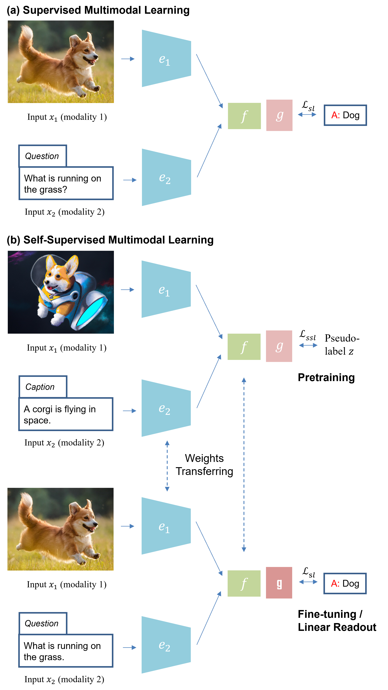
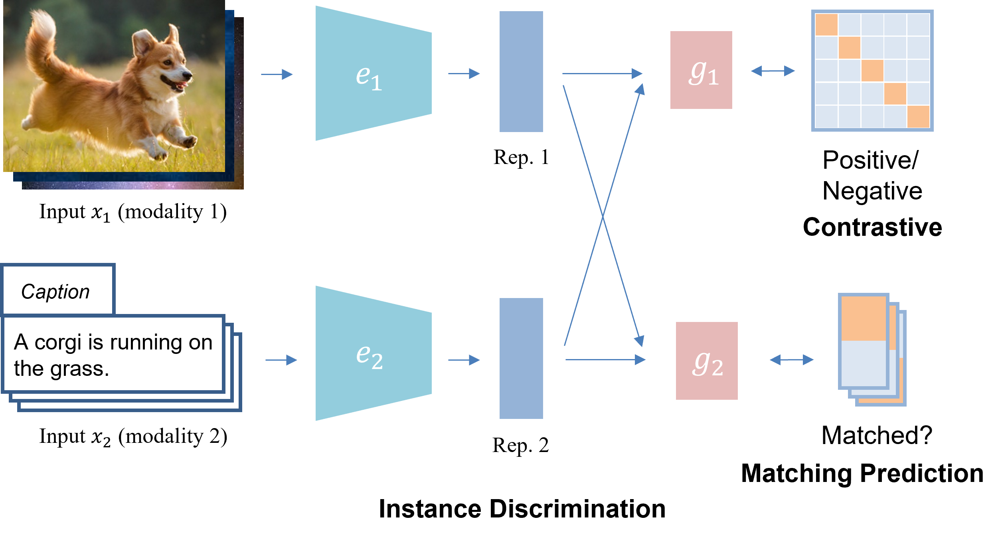
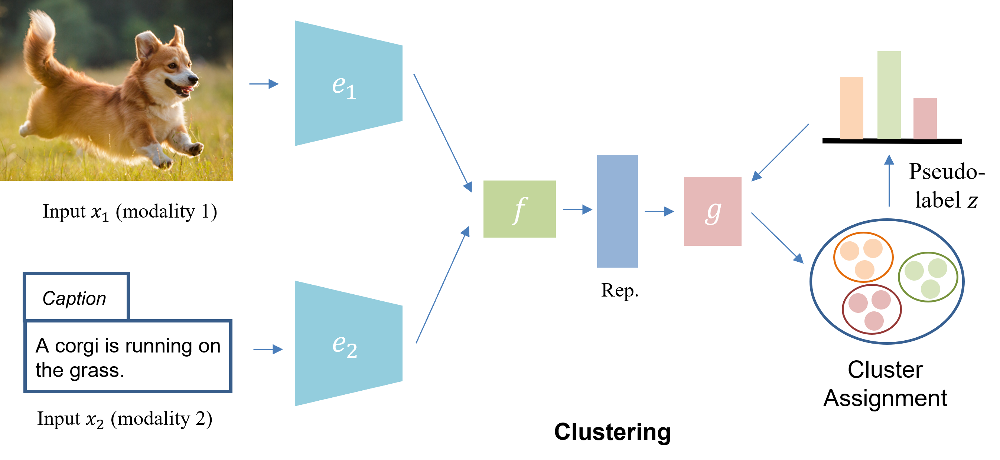
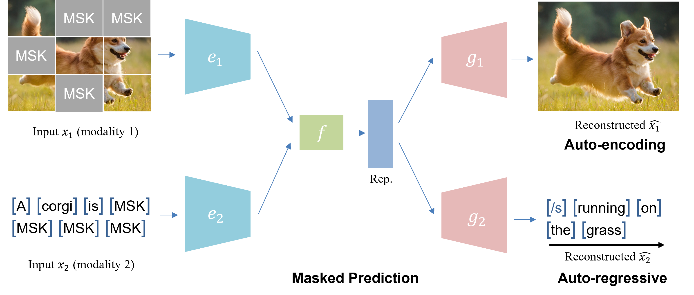

# Awesome-self-supervised-multimodal-learning
A curated list of awesome self-supervised multimodal learning resources. Check our [survey paper](https://arxiv.org/abs/2304.01008) for details!

```
@article{zong2023SSML,
  title={Self-Supervised Multimodal Learning: A Survey},
  author={Zong, Yongshuo and Mac Aodha, Oisin and Hospedales, Timothy},
  journal={arXiv preprint arXiv:2304.01008},
  year={2023}
}
```

## Table of Contents
- [Overview](#overview)
- [Related Survey Papers](#related-survey-papers)
- [Objectives](#objectives)
  - [Instance Discrimination](#instance-discrimination)
  - [Clustering](#clustering)
  - [Masked Prediction](#masked-prediction)
  - [Hybrid](#hybrid)
- [Applications](#applications)
  - [State Representation Learning](#state-representation-learning)
  - [Healthcare](#healthcare)
  - [Remote Sensing](#remote-sensing)
  - [Machine Translation](#machine-translation)
  - [Auto-driving](#auto-driving)
- [Challenges](#challenges)
  - [Resources](#resources)
  - [Robustness/Fairness](#robustnessfairness)
- [Summary of Common Multimodal Datasets](#summary-of-common-multimodal-datasets)
  - [Image-Text Dataset](#image-text-datasets)
  - [Image-Text-Audio Dataset](#image-text-audio-datasets)
  - [Video-Text Datasets](#video-text-datasets)
  - [Video-Audio Datasets](#video-audio-datasets)
  - [Point Cloud Datasets](#point-cloud-datasets)

## Overview
Taxonomy: In our survey, we provide a comprehensive review of the state-of-the-art in SSML, which we categorize along three orthogonal axes: objective functions, data alignment, and model architectures. These axes correspond to the inherent characteristics of self-supervised learning methods and multimodal data. Specifically, we classify training objectives into instance discrimination, clustering, and masked prediction categories. We also discuss multimodal input data pairing and alignment strategies during training. Finally, we review model architectures including the design of encoders, fusion modules, and decoders, which are essential components of SSML methods.

<p align="center">
  
</p>

Learning Paradigms: An example illustrating the self-supervised vision and language pretraining prior to downstream supervised learning
for visual question answering is shown below. (a) supervised multimodal learning, and (b) self-supervised multimodal learning: Top, self-supervised pretraining without manual annotations; Bottom, supervised fine-tuning or linear readout for downstream tasks.

<p align="center">
  
</p>

## Related Survey Papers

- Multimodal machine learning: A survey and taxonomy.
  - *IEEE TPAMI 2018* [[paper]](http://arxiv.org/abs/1705.09406v2)

- Foundations and recent trends in multimodal machine learning: Principles, challenges, and open questions.
  - *arXiv 2022* [[paper]](https://arxiv.org/abs/2209.03430)

- Deep multimodal learning: A survey on recent advances and trends.
  - *IEEE signal processing magazine 2017* [[paper]](https://ieeexplore.ieee.org/document/8103116)

- Multimodal research in vision and language: A review of current and emerging trends.
  - *Information Fusion 2022* [[paper]](http://arxiv.org/abs/2010.09522v2) 

- Self-Supervised Representation Learning: Introduction, advances, and challenges.
  - *IEEE Signal Processing Magazine 2022* [[paper]](https://ieeexplore.ieee.org/document/9770283)

- Self-supervised learning: Generative or contrastive.
  - *IEEE TKDE 2021* [[paper]](https://ieeexplore.ieee.org/document/9462394)

- Self-supervised visual feature learning with deep neural networks: A survey.
  - *IEEE TPAMI 2020* [[paper]](http://arxiv.org/abs/1902.06162v1)

- Vision-language pre-training: Basics, recent advances, and future trends.
  - *arXiv 2022* [[paper]](https://arxiv.org/abs/2210.09263)


## Objectives
### Instance Discrimination
In the context of multimodal learning, instance discrimination often aims to determine whether samples from two input modalities are from the same instance, i.e., paired. By doing so, it attempts to align the representation space of the paired modalities while pushing the representation space of different instance pairs further apart. There are two types of instance discrimination objectives: contrastive and matching prediction, depending on how the input is sampled.



- Learning transferable visual models from natural language supervision.
  - *ICML 2021* [[paper]](http://arxiv.org/abs/2103.00020v1)

- Self-supervised multimodal versatile networks.
  - *NeurIPS 2020* [[paper]](http://arxiv.org/abs/2006.16228v2) [[code]](https://github.com/deepmind/deepmind-research/tree/master/mmv)

- End-to-end learning of visual representations from uncurated instructional videos.
  - *CVPR 2020* [[paper]](http://arxiv.org/abs/1912.06430v4) [[code]](https://github.com/antoine77340/MIL-NCE_HowTo100M)

- Scaling up visual and vision-language representation learning with noisy text supervision.
  - *ICML 2021* [[paper]](http://arxiv.org/abs/2102.05918v2)

- Contrastive Multiview Coding.
  - *ECCV 2019* [[paper]](https://arxiv.org/abs/1906.05849) [[code]](https://github.com/HobbitLong/CMC)

- Audioclip: Extending Clip to Image, Text and Audio.
  - *ICASSP 2022* [[paper]](http://arxiv.org/abs/2106.13043v1) [[code]](https://github.com/AndreyGuzhov/AudioCLIP)

- VideoCLIP: Contrastive Pre-training for Zero-shot Video-Text Understanding.
  - *EMNLP 2021* [[paper]](https://arxiv.org/abs/2109.14084) [[code]](https://github.com/ZrrSkywalker/PointCLIP)

- CLIP4Clip: An Empirical Study of CLIP for End to End Video Clip Retrieval.
  - *Neurocomputing 2021* [[paper]](http://arxiv.org/abs/2104.08860v2) [[code]](https://github.com/ArrowLuo/CLIP4Clip)

- PointCLIP: Point Cloud Understanding by CLIP.
  - *CVPR 2021* [[paper]](http://arxiv.org/abs/2112.02413v1) [[code]](https://github.com/ZrrSkywalker/PointCLIP)

- Image-and-Language Understanding from Pixels Only.
  - *arXiv 2022* [[paper]](https://arxiv.org/abs/2212.08045) [[code]](https://github.com/google-research/big_vision)

- Scaling Language-Image Pre-training via Masking.
  - *arXiv 2022* [[paper]](https://arxiv.org/abs/2212.00794)

- COOKIE: Contrastive Cross-Modal Knowledge Sharing Pre-training for Vision-Language Representation.
  - *ICCV 2021* [[paper]](https://openaccess.thecvf.com/content/ICCV2021/papers/Wen_COOKIE_Contrastive_Cross-Modal_Knowledge_Sharing_Pre-Training_for_Vision-Language_Representation_ICCV_2021_paper.pdf) [[code]](https://github.com/kywen1119/COOKIE)

- Slip: Self-supervision meets language-image pre-training.
  - *ECCV 2022* [[paper]](https://arxiv.org/abs/2112.12750) [[code]](https://github.com/facebookresearch/SLIP)

- Crossclr: Cross-modal contrastive learning for multi-modal video representations.
  - *ICCV 2021* [[paper]](https://arxiv.org/abs/2109.14910) [[code]](https://github.com/amazon-science/crossmodal-contrastive-learning)

- CrossPoint: Self-Supervised Cross-Modal Contrastive Learning for 3D Point Cloud Understanding.
  - *CVPR 2022* [[paper]](http://arxiv.org/abs/2203.00680v3) [[code]](https://github.com/MohamedAfham/CrossPoint)

- Learnable PINs: Cross-Modal Embeddings for Person Identity.
  - *ECCV 2018* [[paper]](http://arxiv.org/abs/1805.00833v2)

- Vatt: Transformers for multimodal self-supervised learning from raw video, audio and text.
  - *NeurIPS 2021* [[paper]](http://arxiv.org/abs/2104.11178v3) [[code]](https://github.com/google-research/google-research/tree/master/vatt)

- Learning Video Representations using Contrastive Bidirectional Transformer.
  - *arXiv* [[paper]](http://arxiv.org/abs/1906.05743v2)


- Learning representations from audio-visual spatial alignment.
  - *NeurIPS 2020* [[paper]](http://arxiv.org/abs/2011.01819v1) [[code]](https://github.com/pedro-morgado/AVSpatialAlignment)

- Sound Localization by Self-Supervised Time Delay Estimation.
  - *ECCV 2022* [[paper]](http://arxiv.org/abs/2204.12489v3) [[code]](https://github.com/IFICL/stereocrw)

- Unified visual-semantic embeddings: Bridging vision and language with structured meaning representations.
  - *CVPR 2019* [[paper]](https://openaccess.thecvf.com/content_CVPR_2019/papers/Wu_Unified_Visual-Semantic_Embeddings_Bridging_Vision_and_Language_With_Structured_Meaning_CVPR_2019_paper.pdf) [[code]](https://github.com/vacancy/SceneGraphParser)

- Fine-Grained Action Retrieval Through Multiple Parts-of-Speech Embeddings.
  - *ICCV 2019* [[paper]](http://arxiv.org/abs/1908.03477v1) [[code]](https://github.com/mwray/Joint-Part-of-Speech-Embeddings)

- Fine-grained Multi-Modal Self-Supervised Learning.
  - *BMVC 2021* [[paper]](https://arxiv.org/abs/2112.12182)

- Self-supervised Feature Learning by Cross-modality and Cross-view Correspondences.
  - *CVPR Workshops 2020* [[paper]](https://openaccess.thecvf.com/content/CVPR2021W/MULA/papers/Jing_Self-Supervised_Feature_Learning_by_Cross-Modality_and_Cross-View_Correspondences_CVPRW_2021_paper.pdf)

- Cooperative Learning of Audio and Video Models from Self-Supervised Synchronization.
  - *NeurIPS 2018* [[paper]](http://arxiv.org/abs/1807.00230v2)

- Audio-Visual Instance Discrimination with Cross-Modal Agreement.
  - *CVPR 2020* [[paper]](http://arxiv.org/abs/2004.12943v3) [[code]](https://github.com/facebookresearch/AVID-CMA)

- Look, Listen and Learn.
  - *ICCV 2017* [[paper]](http://arxiv.org/abs/1705.08168v2)

- Objects that Sound.
  - *ECCV 2018* [[paper]](https://arxiv.org/abs/1712.06651)

- Audio-Visual Scene Analysis with Self-Supervised Multisensory Features.
  - *ECCV 2018* [[paper]](http://arxiv.org/abs/1804.03641v2) [[code]](https://github.com/andrewowens/multisensory)

- The Sound of Pixels.
  - *ECCV 2018* [[paper]](http://arxiv.org/abs/1804.03160v4) [[code]](https://github.com/hangzhaomit/Sound-of-Pixels)

- The Sound of Motions.
  - *ICCV 2019* [[paper]](https://openaccess.thecvf.com/content_ICCV_2019/papers/Zhao_The_Sound_of_Motions_ICCV_2019_paper.pdf)

- Music Gesture for Visual Sound Separation.
  - *CVPR 2020* [[paper]](http://arxiv.org/abs/2004.09476v1)


- Look, Listen, and Attend: Co-Attention Network for Self-Supervised Audio-Visual Representation Learning.
  - *ACM MM 2020* [[paper]](https://arxiv.org/abs/2008.05789)
  


### Clustering
Clustering methods assume that applying end-to-end trained clustering will lead to the grouping of the data by semantically salient characteristics. In practice, these methods iteratively predict the cluster assignments of the encoded representation, and use these predictions, also known as pseudo labels, as supervision signals to update the feature representation. Multimodal clustering provides the opportunity to learn multimodal representations and also improve conventional clustering by using each modality’s pseudolabels to supervise the other.




- Self-Supervised Learning by Cross-Modal Audio-Video Clustering.
  - *NeurIPS 2019* [[paper]](https://arxiv.org/abs/1911.12667) [[code]](http://www.humamalwassel.com/publication/xdc/)

- Labelling unlabelled videos from scratch with multi-modal self-supervision.
  - *NeurIPS 2020* [[paper]](http://arxiv.org/abs/2006.13662v3) [[code]](https://github.com/facebookresearch/selavi)

- Learning Audio-Visual Speech Representation by Masked Multimodal Cluster Prediction.
  - *ICLR 2021* [[paper]](http://arxiv.org/abs/2201.02184v2) [[code]](https://github.com/facebookresearch/av_hubert)

- u-HuBERT: Unified Mixed-Modal Speech Pretraining And Zero-Shot Transfer to Unlabeled Modality.
  - *NeurIPS 2022* [[paper]](http://arxiv.org/abs/2207.07036v2) [[code]](https://github.com/facebookresearch/av_hubert)

- Deep Multimodal Clustering for Unsupervised Audiovisual Learning.
  - *CVPR 2018* [[paper]](http://arxiv.org/abs/1807.03094v3) [[code]](https://github.com/DTaoo/DMC)

- Self-labelling via simultaneous clustering and representation learning.
  - *ICLR 2020* [[paper]](https://arxiv.org/abs/1911.05371) [[code]](https://github.com/yukimasano/self-label)


### Masked Prediction

The masked prediction task can be either performed in an
auto-encoding (similar to BERT) or an auto-regressive
approach (similar to GPT).



- VATLM: Visual-Audio-Text Pre-Training with Unified Masked Prediction for Speech Representation Learning.
  - *arXiv 2022* [[paper]](http://arxiv.org/abs/2211.11275v1) [[code]](https://github.com/microsoft/SpeechT5/tree/main/VATLM)

- CTAL: Pre-training Cross-modal Transformer for Audio-and-Language Representations.
  - *EMNLP 2021* [[paper]](https://arxiv.org/abs/2107.00249) [[code]](https://github.com/Ydkwim/CTAL)

- Image as a Foreign Language: BEiT Pretraining for All Vision and Vision-Language Tasks.
  - *arXiv 2022* [[paper]](http://arxiv.org/abs/2208.10442v2) [[code]](https://github.com/microsoft/unilm/tree/master/beit3)

- SimVLM: Simple Visual Language Model Pretraining with Weak Supervision.
  - *ICLR 2022* [[paper]](http://arxiv.org/abs/2108.10904v3) [[code]](https://github.com/YulongBonjour/SimVLM)

- VideoBERT: A Joint Model for Video and Language Representation Learning.
  - *ICCV 2019* [[paper]](http://arxiv.org/abs/1904.01766v2) [[code]](https://github.com/ammesatyajit/VideoBERT)

- Unified-IO: A Unified Model for Vision, Language, and Multi-Modal Tasks.
  - *ICLR 2023* [[paper]](http://arxiv.org/abs/2206.08916v2) [[code]](https://github.com/allenai/unified-io-inference)

- VL-BEiT: Generative Vision-Language Pretraining.
  - *arXiv 2022* [[paper]](https://arxiv.org/abs/2206.01127) [[code]](https://github.com/microsoft/unilm/tree/master/vl-beit)

- OPT: Omni-Perception Pre-Trainer for Cross-Modal Understanding and Generation.
  - *arXiv 2021* [[paper]](https://arxiv.org/abs/2107.00249) [[code]](https://github.com/mindspore-ai/models/tree/master/research/mm/opt)

- SelfDoc: Self-Supervised Document Representation Learning.
  - *CVPR 2021* [[paper]](https://arxiv.org/abs/2106.03331)

- Deep Bidirectional Language-Knowledge Graph Pretraining.
  - *NeurIPS 2022* [[paper]](http://arxiv.org/abs/2210.09338v2) [[code]](https://github.com/michiyasunaga/dragon)

- ERNIE: Enhanced Language Representation with Informative Entities.
  - *ACL 2019* [[paper]](https://arxiv.org/abs/1905.07129) [[code]](https://github.com/thunlp/ERNIE)

- VLM: Task-agnostic Video-Language Model Pre-training for Video Understanding.
  - *ACL 2021* [[paper]](https://arxiv.org/abs/2105.09996) [[code]](https://github.com/facebookresearch/fairseq/blob/main/examples/MMPT/README.md)

- Unsupervised Vision-and-Language Pre-training Without Parallel Images and Captions.
  - *NAACL 2021* [[paper]](http://arxiv.org/abs/2010.12831v2) [[code]](https://github.com/uclanlp/visualbert)


### Hybrid


- Align before Fuse: Vision and Language Representation Learning with Momentum Distillation.
  - *NeurIPS 2021* [[paper]](http://arxiv.org/abs/2107.07651v2) [[code]](https://github.com/salesforce/ALBEF)

- DM2C: Deep Mixed-Modal Clustering.
  - *NeurIPS 2019* [[paper]](https://papers.nips.cc/paper/2019/hash/6a4d5952d4c018a1c1af9fa590a10dda-Abstract.html) [[code]](https://github.com/jiangyangby/DM2C)

- Oscar: Object-Semantics Aligned Pre-training for Vision-Language Tasks.
  - *ECCV 2020* [[paper]](https://arxiv.org/abs/2004.06165) [[code]](https://github.com/microsoft/Oscar)

- Hero: Hierarchical Encoder for Video+Language Omni-representation Pre-training.
  - *EMNLP 2020* [[paper]](http://arxiv.org/abs/2005.00200v2) [[code]](https://github.com/linjieli222/HERO)

- UniVL: A Unified Video and Language Pre-Training Model for Multimodal Understanding and Generation.
  - *arXiv 2020* [[paper]](https://arxiv.org/abs/2002.06353) [[code]](https://github.com/microsoft/UniVL)

- ActBERT: Learning Global-Local Video-Text Representations.
  - *CVPR 2020* [[paper]](https://openaccess.thecvf.com/content_CVPR_2020/papers/Zhu_ActBERT_Learning_Global-Local_Video-Text_Representations_CVPR_2020_paper.pdf) [[code]](https://github.com/PaddlePaddle/PaddleVideo/blob/develop/docs/en/model_zoo/multimodal/actbert.md)

- MERLOT RESERVE: Neural Script Knowledge through Vision and Language and Sound.
  - *CVPR 2022* [[paper]](http://arxiv.org/abs/2201.02639v4) [[code]](https://github.com/rowanz/merlot_reserve)

- BLIP: Bootstrapping Language-Image Pre-training for Unified Vision-Language Understanding and Generation.
  - *ICML 2022* [[paper]](https://arxiv.org/abs/2201.12086) [[code]](https://github.com/salesforce/BLIP)

- ViLT: Vision-and-Language Transformer Without Convolution or Region Supervision.
  - *ICML 2021* [[paper]](http://arxiv.org/abs/2102.03334v2) [[code]](https://github.com/dandelin/ViLT)

- UNITER: UNiversal Image-TExt Representation Learning.
  - *ECCV 2019* [[paper]](https://arxiv.org/abs/1909.11740) [[code]](https://github.com/ChenRocks/UNITER)

- VLMo: Unified Vision-Language Pre-Training with Mixture-of-Modality-Experts.
  - *NeurIPS 2022* [[paper]](https://arxiv.org/abs/2111.02358) [[code]](https://github.com/microsoft/unilm/tree/master/vlmo)

- FLAVA: A Foundational Language And Vision Alignment Model.
  - *CVPR 2021* [[paper]](http://arxiv.org/abs/2112.04482v3) [[code]](https://github.com/facebookresearch/multimodal/tree/main/examples/flava)

- Vlmixer: Unpaired vision-language pre-training via cross-modal cutmix.
  - *ICML 2022* [[paper]](http://arxiv.org/abs/2206.08919v1)

- ViLBERT: Pretraining Task-Agnostic Visiolinguistic Representations for Vision-and-Language Tasks.
  - *NeurIPS 2019* [[paper]](http://arxiv.org/abs/1908.02265v1) [[code]](https://github.com/facebookresearch/vilbert-multi-task)

- Unsupervised Vision-and-Language Pretraining via Retrieval-based Multi-Granular Alignment.
  - *CVPR 2022* [[paper]](https://arxiv.org/abs/2203.00242) [[code]](https://github.com/zmykevin/UVLP)

- Unimo: Towards unified-modal understanding and generation via cross-modal contrastive learning.
  - *ACL 2021* [[paper]](https://aclanthology.org/2021.acl-long.202/) [[code]](https://github.com/PaddlePaddle/Research/tree/master/NLP/UNIMO)


- Multimodal Pretraining Unmasked: A Meta-Analysis and a Unified Framework of Vision-and-Language BERTs.
  - *TACL 2020* [[paper]](http://arxiv.org/abs/2011.15124v2) [[code]](https://github.com/e-bug/mpre-unmasked)

- Multimodal Deep Autoencoder for Human Pose Recovery.
  - *IEEE TIP 2015* [[paper]](https://ieeexplore.ieee.org/document/7293666)

- Self-supervised object detection from audio-visual correspondence.
  - *CVPR 2021* [[paper]](http://arxiv.org/abs/2104.06401v2)

- Multimodal Clustering Networks for Self-supervised Learning from Unlabeled Videos.
  - *ICCV 2021* [[paper]](http://arxiv.org/abs/2104.12671v3) [[code]](https://github.com/brian7685/Multimodal-Clustering-Network)

- Self-Supervised Learning of Audio-Visual Objects from Video.
  - *ECCV 2020* [[paper]](https://arxiv.org/abs/2111.02358) [[code]](https://github.com/afourast/avobjects)


- Coot: Cooperative hierarchical transformer for video-text representation learning.
  - *NeurIPS 2020* [[paper]](https://arxiv.org/abs/2011.00597) [[code]](https://github.com/gingsi/coot-videotext)

- Unpaired Image Captioning via Scene Graph Alignments.
  - *ICCV 2019* [[paper]](http://arxiv.org/abs/1903.10658v4) [[code]](https://github.com/gujiuxiang/unpaired_image_captioning)


## Applications

### State Representation Learning

- State representation learning for control: An overview
  - *Neural Networks 2018* [[paper]](https://arxiv.org/abs/1802.04181)

- Unsupervised Representation Learning in Deep Reinforcement Learning: A Review
  - *arXiv 2022* [[paper]](https://arxiv.org/abs/2208.14226)

- Action-Conditional Video Prediction using Deep Networks in Atari Games
  - *NeurIPS 2015* [[paper]](https://arxiv.org/abs/1507.08750) [[code]](https://github.com/junhyukoh/nips2015-action-conditional-video-prediction)

- Recurrent World Models Facilitate Policy Evolution
  - *NeurIPS 2018* [[paper]](https://arxiv.org/abs/1809.01999) [[code]](https://github.com/hardmaru/WorldModelsExperiments)

- Learning latent dynamics for planning from pixels
  - *ICML 2019* [[paper]](https://arxiv.org/abs/1811.04551) [[code]](https://github.com/google-research/planet)

- Learning to Poke by Poking: Experiential Learning of Intuitive Physics
  - *NeurIPS 2016* [[paper]](https://arxiv.org/abs/1606.07419)

- Learning Predictive Representations for Deformable Objects Using Contrastive Estimation
  - *CoRL 2021* [[paper]](https://arxiv.org/abs/2003.05436) [[code]](https://github.com/wilson1yan/contrastive-forward-model)


### Healthcare

- Multimodal biomedical AI.
  - *Nature Medicine 2022* [[paper]](https://www.nature.com/articles/s41591-022-01981-2) 

- MedCLIP: Contrastive Learning from Unpaired Medical Images and Text.
  - *EMNLP 2022* [[paper]](http://arxiv.org/abs/2210.10163v1) [[code]](https://github.com/RyanWangZf/MedCLIP)

- ContIG: Self-supervised multimodal contrastive learning for medical imaging with genetics.
  - *CVPR 2022* [[paper]](http://arxiv.org/abs/2111.13424v1) [[code]](https://github.com/HealthML/ContIG)

- CoMIR: Contrastive multimodal image representation for registration.
  - *NeurIPS 2020* [[paper]](http://arxiv.org/abs/2006.06325v2) [[code]](https://github.com/MIDA-group/CoMIR)

- Contrastive learning of medical visual representations from paired images and text.
  - *arXiv 2020* [[paper]](http://arxiv.org/abs/2010.00747v2) [[code]](https://github.com/edreisMD/ConVIRT-pytorch)

- GLoRIA: A Multimodal Global-Local Representation Learning Framework for Label-efficient Medical Image Recognition.
  - *ICCV 2021* [[paper]](https://openaccess.thecvf.com/content/ICCV2021/papers/Huang_GLoRIA_A_Multimodal_Global-Local_Representation_Learning_Framework_for_Label-Efficient_Medical_ICCV_2021_paper.pdf) [[code]](https://github.com/marshuang80/gloria)

- Expert-level detection of pathologies from unannotated chest X-ray images via self-supervised learning.
  - *Nature Biomedical Engineering 2022* [[paper]](https://www.nature.com/articles/s41551-022-00936-9) [[code]](https://github.com/rajpurkarlab/CheXzero)

- Generalized radiograph representation learning via cross-supervision between images and free-text radiology reports.
  - *Nature Machine Intelligence 2022* [[paper]](https://www.nature.com/articles/s42256-021-00425-9) [[code]](https://github.com/funnyzhou/REFERS)


### Remote Sensing

- Multimodal remote sensing benchmark datasets for land cover classification with a shared and specific feature learning model.
  - *ISPRS Journal of Photogrammetry and Remote Sensing 2021* [[paper]](http://arxiv.org/abs/2105.10196v1) [[code]](https://github.com/danfenghong/ISPRS_S2FL)

- Self-Supervised SAR-Optical Data Fusion of Sentinel-1/-2 Images.
  - *IEEE Transactions on Geoscience and Remote Sensing 2022* [[paper]](https://ieeexplore.ieee.org/document/9614157)

- Semi-Supervised Learning for Joint SAR and Multispectral Land Cover Classification.
  - *IEEE Geoscience and Remote Sensing Letters 2021* [[paper]](http://dx.doi.org/10.1109/LGRS.2022.3195259)

- Self-Supervised Change Detection in Multiview Remote Sensing Images.
  - *IEEE Transactions on Geoscience and Remote Sensing 2021* [[paper]](https://arxiv.org/abs/2103.05969) [[code]](https://github.com/cyx669521/self-supervised_change_detetction)

- Self-Supervised Multisensor Change Detection.
  - *IEEE Transactions on Geoscience and Remote Sensing 2021* [[paper]](https://arxiv.org/abs/2103.05102) [[code]](https://gitlab.lrz.de/ai4eo/cd/tree/main/sarOpticalMultisensorTgrs2021)

- Self-supervised Audiovisual Representation Learning for Remote Sensing Data.
  - *Int. J. Appl. Earth Obs. Geoinformation 2021* [[paper]](http://arxiv.org/abs/2108.00688v1) [[code]](https://github.com/khdlr/SoundingEarth)


### Machine Translation

- A Survey of Multilingual Neural Machine Translation.
  - *ACM Computing Surveys 2019* [[paper]](https://dl.acm.org/doi/abs/10.1145/3406095)

- Unsupervised Machine Translation Using Monolingual Corpora Only.
  - *ICLR 2018* [[paper]](http://arxiv.org/abs/1711.00043v2) [[code]](https://github.com/sobamchan/unsupervised-machine-translation-using-monolingual-corpora-only-pytorch)

- Google’s Multilingual Neural Machine Translation System: Enabling Zero-Shot Translation.
  - *TACL 2016* [[paper]](https://arxiv.org/abs/1611.04558)

- Visual Grounding in Video for Unsupervised Word Translation.
  - *CVPR 2020* [[paper]](http://arxiv.org/abs/2003.05078v2) [[code]](https://github.com/gsig/visual-grounding)

- Multilingual Unsupervised NMT using Shared Encoder and Language-Specific Decoders.
  - *ACL 2019* [[paper]](https://aclanthology.org/P19-1297/)

- The Missing Ingredient in Zero-Shot Neural Machine Translation.
  - *arXiv 2019* [[paper]](http://arxiv.org/abs/1903.07091v1)

### Auto-driving

- Multi-modal Sensor Fusion for Auto Driving Perception: A Survey.
  - *arXiv 2022* [[paper]](http://arxiv.org/abs/2202.02703v2) 

- Image-to-Lidar Self-Supervised Distillation for Autonomous Driving Data.
  - *CVPR 2022* [[paper]](http://arxiv.org/abs/2203.16258v1) [[code]](https://github.com/valeoai/SLidR)

- Advancing Self-supervised Monocular Depth Learning with Sparse LiDAR.
  - *CoRL 2021* [[paper]](http://arxiv.org/abs/2109.09628v4) [[code]](https://github.com/AutoAILab/FusionDepth)

- There is More than Meets the Eye: Self-Supervised Multi-Object Detection and Tracking with Sound by Distilling Multimodal Knowledge.
  - *CVPR 2021* [[paper]](http://arxiv.org/abs/2103.01353v1) [[code]](http://multimodal-distill.cs.uni-freiburg.de/)

- Unsupervised Learning of Depth, Optical Flow and Pose with Occlusion from 3D Geometry.
  - *T-ITS 2022* [[paper]](https://ieeexplore.ieee.org/document/9152137) [[code]](https://github.com/guangmingw/DOPlearning)

### Robotics

- Making Sense of Vision and Touch: Self-Supervised Learning of Multimodal Representations for Contact-Rich Tasks.
  - *ICRA 2018* [[paper]](https://arxiv.org/abs/1810.10191)

- Self-Supervised Visual Terrain Classification From Unsupervised Acoustic Feature Learning.
  - *IEEE Transactions on Robotics 2019* [[paper]](http://arxiv.org/abs/1912.03227v1)

- Vision-Language Navigation with Self-Supervised Auxiliary Reasoning Tasks.
  - *CVPR 2020* [[paper]](https://openaccess.thecvf.com/content_CVPR_2020/papers/Zhu_Vision-Language_Navigation_With_Self-Supervised_Auxiliary_Reasoning_Tasks_CVPR_2020_paper.pdf)

- Two stream networks for self-supervised ego-motion estimation.
  - *CoRL 2019* [[paper]](http://proceedings.mlr.press/v100/ambrus20a/ambrus20a.pdf)

- Connecting Touch and Vision via Cross-Modal Prediction.
  - *CVPR 2019* [[paper]](https://arxiv.org/abs/1906.06322)

## Challenges

### Resources

- Contrastive Vision-Language Pre-training with Limited Resources.
  - *ECCV 2022* [[paper]](https://arxiv.org/abs/2112.09331) [[code]](https://github.com/zerovl/ZeroVL)

- Beyond neural scaling laws: beating power law scaling via data pruning.
  - *NeurIPS 2022* [[paper]](http://arxiv.org/abs/2206.14486v5) [[code]](https://github.com/naotoo1/Beyond-Neural-Scaling)

- Supervision Exists Everywhere: A Data Efficient Contrastive Language-Image Pre-training Paradigm.
  - *ICLR 2022* [[paper]](http://arxiv.org/abs/2110.05208v2) [[code]](https://github.com/Sense-GVT/DeCLIP)

### Robustness/Fairness

- When and why Vision-Language Models behave like Bags-of-Words, and what to do about it?.
  - *ICLR 2023* [[paper]](https://arxiv.org/abs/2210.01936) [[code]](https://github.com/mertyg/vision-language-models-are-bows)

- Robustness Analysis of Video-Language Models Against Visual and Language Perturbations.
  - *NeurIPS Datasets and Benchmarks Track 2022* [[paper]](http://arxiv.org/abs/2207.02159v3) [[code]](https://sites.google.com/view/videolanguagerobustness/home)

- Using Self-Supervised Learning Can Improve Model Robustness and Uncertainty.
  - *NeurIPS 2019* [[paper]](https://arxiv.org/abs/1906.12340) [[code]](https://github.com/hendrycks/ss-ood)

- Badencoder: Backdoor attacks to pre-trained encoders in self-supervised learning.
  - *2022 IEEE Symposium on Security and Privacy (SP) 2022* [[paper]](https://arxiv.org/abs/2108.00352) [[code]](https://github.com/jinyuan-jia/BadEncoder)

- Are Multimodal Models Robust to Image and Text Perturbations?.
  - *arXiv 2022* [[paper]](http://arxiv.org/abs/2212.08044v1) [[code]](https://github.com/amazon-science/multimodal-robustness)

- A Study of Gender Impact in Self-supervised Models for Speech-to-Text Systems.
  - *Interspeech 2022* [[paper]](https://arxiv.org/abs/2204.01397) 
  
- Evaluating CLIP: Towards Characterization of Broader Capabilities and Downstream Implications.
  - *arXiv 2021* [[paper]](http://arxiv.org/abs/2108.02818v1)

- Mind the Gap: Understanding the Modality Gap in Multi-modal Contrastive Representation Learning.
  - *NeurIPS 2022* [[paper]](http://arxiv.org/abs/2203.02053v2) [[code]](https://github.com/Weixin-Liang/Modality-Gap)

- Multimodal datasets: misogyny, pornography, and malignant stereotypes.
  - *arXiv 2021* [[paper]](http://arxiv.org/abs/2110.01963v1)

- On the opportunities and risks of foundation models.
  - *arXiv 2021* [[paper]](https://arxiv.org/abs/2108.07258)

- Extracting Training Data from Diffusion Models.
  - *arXiv 2023* [[paper]](http://arxiv.org/abs/2301.13188v1)

- Worst of Both Worlds: Biases Compound in Pre-trained Vision-and-Language Models.
  - *Proceedings of the 4th Workshop on Gender Bias in Natural Language Processing (GeBNLP) 2022* [[paper]](http://arxiv.org/abs/2104.08666v2)

- Decoupling the Role of Data, Attention, and Losses in Multimodal Transformers.
  - *TACL 2021* [[paper]](http://arxiv.org/abs/2102.00529v1) [[code]](https://github.com/deepmind/multimodal_transformers)

- What makes for good views for contrastive learning?.
  - *NeurIPS 2020* [[paper]](http://arxiv.org/abs/2005.10243v3) [[code]](https://github.com/HobbitLong/PyContrast)


## Summary of Common Multimodal Datasets
                   
### Image-Text Datasets

| **Name**                   | **# Images**                                                    | **# Text**                     | **Domain**       | **Task**                                          | **Access**                                                                                            | **Github**                                                                |
|----------------------------|-----------------------------------------------------------------|--------------------------------|------------------|---------------------------------------------------|-----------------------------------------------------------------------------------------------------|---------------------------------------------------------------------------|
| **COCO**                   | >330000                                                         | >1.5M                          | Natural images   | image captioning, image-text retrieval            |[Link](https://cocodataset.org/)|[Github](https://github.com/tylin/coco-caption)|
| **Flickr30k**              | 31,000                                                          | 5 sentences for each image     | Natural images   | image captioning, image-text retrieval            |[Link](https://shannon.cs.illinois.edu/DenotationGraph/)| -                                                                         |
| **FlickrStyle10K**         | 10,000                                                          | 10,000                         | Natural images   | image captioning (stylized), image-text retrieval |[Link](https://zhegan27.github.io/Papers/FlickrStyle_v0.9.zip)|[Github](https://github.com/kacky24/stylenet)|
| **Flickr8k**               | 8,000                                                           | 5 for each                     | Natural images   | image captioning, image-text retrieval            |[Link](https://www.kaggle.com/datasets/adityajn105/flickr8k)|[Github](https://github.com/goodwillyoga/Flickr8k_dataset)|
| **Flickr8k-CN**            | 8,000                                                           | 8,000                          | Natural images   | image captioning, image-text retrieval            |[Link](https://github.com/li-xirong/flickr8kcn)|[Github](https://github.com/li-xirong/flickr8kcn)|
| **SentiCap**               | 1671/1500                                                       | 4892/3977                      | Natural images   | image captioning (stylized), image-text retrieval |[Link](http://users.cecs.anu.edu.au/~u4534172/senticap.html)| -                                                                         |
| **SBU Captions**           | 1M                                                              | 1M                             | Natural images   | image captioning, image-text retrieval            |[Link](https://www.cs.rice.edu/~vo9/sbucaptions/)|[Link](https://pytorch.org/vision/stable/generated/torchvision.datasets.SBU.html)|
| **Conceptual Captions**    | 3M                                                              | 3M                             | Natural images   | image captioning, image-text retrieval            |[Link](https://ai.google.com/research/ConceptualCaptions/)|[Github](https://github.com/google-research-datasets/conceptual-captions)|
| **AIC-ICC**                | 210K                                                            | 210K                           | Natural images   | image captioning, image-text retrieval            |[Link](https://challenger.ai/)|[Github](https://github.com/ruotianluo/Image_Captioning_AI_Challenger)|
| **Wikipedia**              | 2866                                                            | 2866                           | document         | image captioning, image-text retrieval            | ?                                                                                             |[Github](https://github.com/emanuetre/crossmodal)|
| **NUS-WIDE-10K**           | 10K                                                             | 10K                            | Natural images   | image captioning, image-text retrieval            |[Link](https://lms.comp.nus.edu.sg/wp-content/uploads/2019/research/nuswide/NUS-WIDE.html)| -                                                                         |
| **Yelp**                   | 200,100                                                         | 6,990,280                      | product review   | summarization                                     |[Link](https://www.yelp.com/dataset)|                     -                                                      |
| **VQA v2.0**               | 204,721                                                         | 1105904/11,059,040 (Q/A)       | Natural images   | VQA                                               |[Link](https://visualqa.org/)| -                                                                         |
| **ImageCLEF 2019 VQA-Med** | 3825                                                            | 3825                           | Medicine         | VQA                                               |[Link](https://www.aicrowd.com/challenges/imageclef-2019-vqa-med)|[Github](https://github.com/abachaa/VQA-Med-2019)|
| **VCR**                    | 110k                                                            | 290k/290k/290k (Q/A/Rationale) | natural          | visual commonsense reasoning (VCR)                |[Link](https://visualcommonsense.com/)|[Github](https://github.com/rowanz/r2c)|
| **GD-VCR**                 | 328                                                             | 886/886(Q/A)                   | Geo-Diverse      | visual commonsense reasoning (VCR)                |[Link](https://github.com/WadeYin9712/GD-VCR)|[Github](https://github.com/wadeyin9712/gd-vcr)|
| **SNLI-VE**                | [Details](https://github.com/necla-ml/SNLI-VE#distribution-by-split)|                      | Natural images   | Visual Entailment                                 |[Link](https://github.com/necla-ml/SNLI-VE)|[Github](https://github.com/necla-ml/SNLI-VE)|
| **NLVR2**                  | 107,292                                                         | 107,292                        | Natural images   | natural language for visual reasoning             |[Link](https://lil.nlp.cornell.edu/nlvr/)|[Github](https://github.com/lil-lab/nlvr)|
| **NLVR**                   | 92244                                                           | 92244                          | synthetic images | natural language for visual reasoning             |[Link](https://lil.nlp.cornell.edu/nlvr/)|[Github](https://github.com/lil-lab/nlvr)|
| **rendered SST2**          | ~1k                                                             | ~1k                            | image of text    | optical character recognition (OCR)               |[Link](https://github.com/openai/CLIP/blob/main/data/rendered-sst2.md)|               -                                                      |
| **OCR-CC**                 | 1.4M                                                            | 1.4M                           | Natural images   | optical character recognition (OCR)               |[Link](https://docs.microsoft.com/en-us/azure/cognitive-services/computer-vision/concept-recognizing-text)|[Github](https://github.com/microsoft/TAP)|
| **Hateful Memes**          | 10k+                                                            | 10k+                           | memes            | optical character recognition (OCR)               |[Link](https://hatefulmemeschallenge.com/)|[Github](https://github.com/facebookresearch/mmf)|
| **CORD**                   | 1K                                                              | 1k                             | document         | OCR                                               |[Link](https://github.com/clovaai/cord)|[Github](https://github.com/clovaai/cord)|
| **RefCOCO+**               | 19,992                                                          | 141,564                        | Natural images   | Visual Grounding                                  |[Link](https://github.com/lichengunc/refer)|[Github](https://github.com/lichengunc/refer)|

### Image-Text-Audio Datasets

| **Name**                 | **# Images** | **# Text** | **Domain** | **Task**            | **Access**                                                 | **Github**                                     |
|--------------------------|--------------|------------|------------|--------------------------------------|----------------------------------------------------------|------------------------------------------------|
| **Localized Narratives** | 848,749      | 873,107    | natural    | Image captioning, Paragraph generation, VQA, Phrase grounding etc. |  [Link](https://google.github.io/localized-narratives/)|[Github](https://github.com/google/localized-narratives)|
| **open image**           | 0.6M         | 0.6M       | natural    | Image captioning, detection, segmentation, VQA, etc                |       [Link](https://storage.googleapis.com/openimages/web/index.html)|[Github](https://github.com/openimages/dataset)|


### Video-Text Datasets

| **Name**                 | **# Video / # clips**                | **# Text** | **Domain**             | **Task**                                                    | **link**                                                                                                                          | **Github**                                                  |
|--------------------------|--------------------------------------|------------|------------------------|-------------------------------------------------------------|-----------------------------------------------------------------------------------------------------------------------------------|-------------------------------------------------------------|
| **ActivityNet Captions** | 20k: 100k                            | 100k       | natural                | Video Captioning, video-text retrieval                      |[Link](https://cs.stanford.edu/people/ranjaykrishna/densevid/)|[Github](https://github.com/ttengwang/dense-video-captioning-pytorch)|
| **V2C**                  | 9k                                   | 27k        | natural (human action) | Video Captioning, video-text retrieval                      |[Link](https://drive.google.com/file/d/1qt0JsOAqBsdCTlDUw0gw7c_IosShysoW/view?usp=sharing)|[Github](https://github.com/jacobswan1/Video2Commonsense)|
| **VATEX**                | 41.3k                                | 826k       | natural                | Video Captioning, video-text retrieval                      |[Link](https://eric-xw.github.io/vatex-website/index.html)|[Github](https://github.com/eric-xw/Video-guided-Machine-Translation)|
| **YouCook2**             | 2k:15.4k                             | 15.4k      | Cooking                | Video Captioning, video-text retrieval                      |[Link](http://youcook2.eecs.umich.edu/)|[Github](https://github.com/LuoweiZhou/ProcNets-YouCook2)|
| **Charades**             | 10k:10k                              | 27.8k      | Indoor activity        | Video Captioning, video-text retrieval, action recognition  |          [Link](http://vuchallenge.org/charades.html)               | -              
| **MSR-VTT**              | 7k:10k                               | 200k       | natural                | Video Captioning, video-text retrieval                      |[Link](https://www.microsoft.com/en-us/research/publication/msr-vtt-a-large-video-description-dataset-for-bridging-video-and-language/)|[Github](https://github.com/crux82/msr-vtt-it)|
| **MSVD**                 | 2k:2k                                | 70k        | natural                | Video Captioning, video-text retrieval                      | -                                                                                                                           |         -                                                    |
| **HowTo100M**            | 1.2M: 136M                           | 136M       | instructional video    | Video Captioning, video-text retrieval, action locolization |[Link](https://www.di.ens.fr/willow/research/howto100m/)|                                  -                           |
| **TGIF**                 | 102k: 102k                           | 126k       | animated GIFs          | Video Captioning, video-text retrieval                      |[Link](https://github.com/raingo/TGIF-Release)|[Github](https://github.com/raingo/TGIF-Release)|
| **TACoS-MLevel**         | 185:25k                              | 75k        | Cooking                | Video Captioning, video-text retrieval                      |[Link](https://www.mpi-inf.mpg.de/departments/computer-vision-and-machine-learning/research/vision-and-language/tacos-multi-level-corpus)| -                                                           |
| **CrossTask**            | 4.7K:-                               | 4.7k       | instructional          | Temporal action localization                                |[Link](https://github.com/DmZhukov/CrossTask)|[Github](https://github.com/DmZhukov/CrossTask)|
| **MiningYoutube**        | 20k:200k                             | 200k       | Cooking                | Temporal action localization                                |[Link](https://github.com/hildekuehne/Mining_YouTube_dataset)|[Github](https://github.com/hildekuehne/Mining_YouTube_dataset)|
| **COIN**                 | 11,827:-                             | 46,354     | 12 different domains   | Action Segmentation                                         |[Link](https://coin-dataset.github.io/)|[Github](https://github.com/coin-dataset/annotations)|
| **Breakfast**            | -:11267                              | 11267      | cooking                | Action Segmentation                                         |[Link](https://serre-lab.clps.brown.edu/resource/breakfast-actions-dataset/)| -                                                           |
| **LSMDC**                | 200:128k                             | 128k       | Movie                  | Video Captioning, video-text retrieval                      |[Link](https://sites.google.com/site/describingmovies/)| -                                                           |
| **HOMAGE**               | 1.75K                                |            | Indoor activity        | Activity Classification                                     |[Link](https://homeactiongenome.org/)|[Github](https://github.com/nishantrai18/homage)|


### Video-Audio Datasets

| **Name**       | **# Video-audio** | **# utterance** | **Domain**        | **Task**                                                                                                                             | **Access**                                                                        | **Github**                                                           |
|----------------|-------------------|-----------------|-------------------|--------------------------------------------------------------------------------------------------------------------------------------|---------------------------------------------------------------------------------|----------------------------------------------------------------------|
| **SoundNet**   | 2M                |                 | natural           | Audio-visual correspondence                                                                                                          |[Link](http://projects.csail.mit.edu/soundnet/)|[Github](https://github.com/cvondrick/soundnet)|
| **MUSIC**      | 714               |                 | music instruments | Audio-visual correspondence                                                                                                          |[Link](https://github.com/roudimit/MUSIC_dataset)|[Github](https://github.com/hangzhaomit/Sound-of-Pixels)|
| **AVSpeech**   | 290k              |                 | Person            | Audio-visual correspondence                                                                                                          |[Link](https://looking-to-listen.github.io/avspeech/)|[Github](https://github.com/JusperLee/Looking-to-Listen-at-the-Cocktail-Party)|
| **URMP**       | 44                |                 | music instruments | Audio-visual correspondence                                                                                                          |[Link](https://labsites.rochester.edu/air/projects/URMP.html)| -                                                                    |
| **AV-Bench**   | v1 ~5k, v2 ~7k    |                 | natural           | Audio-Visual Correspondence (AVC), Audio-Visual Event Localization (AVEL) and video parsing (AVVP), Sound Source Localization (SSL), etc. |[Link](https://opennlplab.github.io/AVSBench/)|[Github](https://github.com/OpenNLPLab/AVSBench)|
| **AVE**        | 4143              |                 | natural           | temporal localization                                                                                                                |[Link](https://sites.google.com/view/audiovisualresearch)|[Github](https://github.com/YapengTian/AVE-ECCV18)|
| **360° video** | 1146              |                 | camera            | Spatial Audio generation                                                                                                             |[Link](https://pedro-morgado.github.io/spatialaudiogen/)|[Github](https://github.com/pedro-morgado/spatialaudiogen)|
| **openpose**   |                   |                 | person            | Audio-visual correspondence, music-to-video generation                                                                               |[Link](https://cmu-perceptual-computing-lab.github.io/openpose/web/html/doc/index.html)|[Github](https://github.com/CMU-Perceptual-Computing-Lab/openpose)|
| **LRS2**       | -                 | 144481          | person            | speech recognition, lips reading                                                                                                     |[Link](https://www.robots.ox.ac.uk/~vgg/data/lip_reading/lrs2.html)|[Github](https://github.com/lsrock1/WLSNet_pytorch)|
| **LRS3**       | 9506              | 151819          | person            | speech recognition, lips reading                                                                                                     |[Link](https://www.robots.ox.ac.uk/~vgg/data/lip_reading/lrs3.html)| -                                                                   |


### Point Cloud Datasets

| **Name**         | **# mesh**  | **Domain**                 | **Task**                           | **Access**                                      | **Github**                                    |
|------------------|---------|------------------------|--------------------------------|-------------------------------------------|-------------------------------------------|
| **ModelNet40**   | 12,311  | CAD models             | Classification, reconstruction |[Link](https://modelnet.cs.princeton.edu/)|[Github](https://github.com/zhirongw/3DShapeNets)||
| **ShapeNet**     | 220,000 | 3D models              | Classification, reconstruction |[Link](https://www.shapenet.org/)| -                                         |
| **ScanObjectNN** | 2902    | real-world point cloud | Classification, reconstruction |[Link](https://hkust-vgd.github.io/scanobjectnn/)|[Github](https://github.com/hkust-vgd/scanobjectnn)|


### Image-Ridar Datasets

| **Name**               | **# images** | **# points (M)** | **Domain**   | **Task**                  | **link**                               | **Github**                                   |
|------------------------|--------------|------------------|--------------|---------------------------|----------------------------------------|----------------------------------------------|
| **Eigen split KITTTI** | 7481+7518    | 1799             | auto driving | detection                 |[Link](https://www.cvlibs.net/datasets/kitti/)|                                        -      |
| **nuScenes**           |              |                  | auto driving | 3D detection and tracking |[Link](https://www.nuscenes.org/)|[Github](https://github.com/nutonomy/nuscenes-devkit)|
| **SemanticKITTI**      | 23201+20351  | 4549             | auto driving | segmentation              |[Link](http://www.semantic-kitti.org/)|[Github](https://github.com/PRBonn/semantic-kitti-api)|


## Contribute
PR welcome using the following markdown format:
```
- Paper Name. 
  - *Conference Year*. [[paper]](link) [[code]](link)
```
